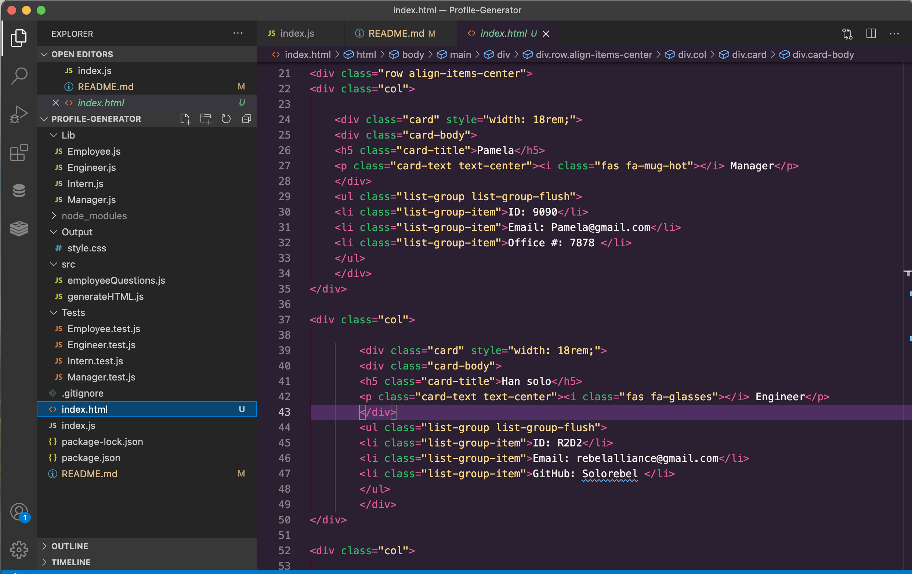

# Profile-Generator

## Description
A Node.js command-line application that takes in information about employees on a software engineering team, then generates an HTML webpage that displays summaries for each person. 

Here is a link to the walk-through video: 
https://drive.google.com/file/d/1dTEhBT67-dIHwO9etqhBwnO2NOjNhOBe/view 

## Table of Contents

- [Description](#description)
- [Installation](#installation)
- [Usage](#usage)
- [Credits](#credits)
- [License](#license)
- [Contact Information](#contact-information)

## Installation
1. Clone this repository into a file on your computer into whichever folder you prefer
2. Initiate Node.js with 'node init'
3. Install the Inquirer package with 'node i inquirer'
4. Install the Jest package with 'node i jest'
5. Navigate to each test file in the Tests folder and enter 'node run test' in the command line in an integrated terminal to run tests 
6. Navigate to the index.js file and enter 'node index.js' in the command line in an integrated terminal to create an html file with information about employees on a software engineering team

## Usage
Use this application to create an HTML file that displays a summary of each of your employee's contact information 

## Credits
I am the sole contributor to this project. You can find my contact information down below!

## Challenges
The greatest challenge of this project was determining what approach I was going to take when inserting the user's input into the index.html file. 

## Contact Information
If you have any questions about this project, please email me here: Hammondpamelac@gmail.com. My GitHub username is: www.github.com/PamtheHam